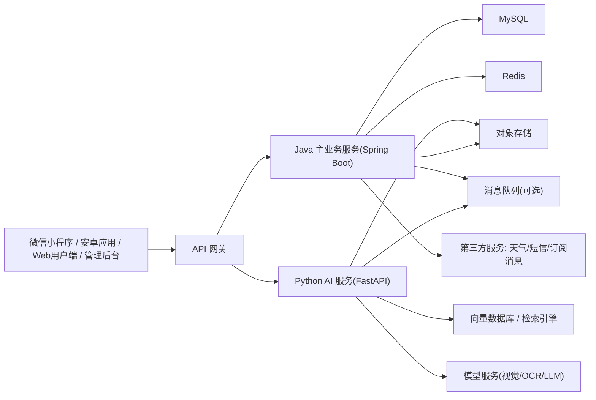

# 痛风小助手技术架构

## 一、产品目标

### 1.1 产品北极星
“痛风小助手”最终目标不是做一个被动问答工具，而是建设一个面向痛风及高尿酸人群的主动管理平台。平台需要具备持续感知、风险识别、主动提醒、个性化干预和长期陪伴能力，帮助用户把“发作后补救”转变为“发作前预防”。

### 1.2 产品阶段目标

#### 第一阶段：验证核心闭环
目标是验证用户是否愿意持续使用产品完成饮食识别、指标记录和风险提醒。

核心问题：
- 用户是否愿意拍照记录饮食
- 用户是否愿意持续记录尿酸、体重、发作情况
- 风险提示是否能够影响用户行为
- 产品是否具备 7 天和 30 天留存基础

#### 第二阶段：建立信任与个性化能力
目标是让系统从“能记录”升级到“更懂用户”，增强平台可信度与个体适配能力。

核心问题：
- 系统能否稳定解析化验单并形成趋势分析
- 问答系统能否基于权威知识库提供安全、可追溯的建议
- 是否可以总结用户个人诱因、风险模式与复查节奏

#### 第三阶段：升级为主动管理平台
目标是实现从工具型产品向主动健康管理服务转型。

核心问题：
- 能否基于天气、饮食、指标和历史发作情况进行主动预警
- 能否接入家庭监督、设备联动和长期画像
- 能否形成平台级的留存、服务和商业闭环

### 1.3 产品定位总结
平台短期定位是“痛风饮食与风险管理助手”，中期定位是“个性化健康管理系统”，长期定位是“痛风主动管理平台”。

## 二、产品能力分层

### 2.1 P0 核心能力
- 饮食拍照识别与红黄绿风险分级
- 尿酸、体重、疼痛发作基础记录
- 每日提醒、饮水提醒、风险反馈
- 用户基础档案管理

### 2.2 P1 增强能力
- 化验单 OCR 解析
- 指南知识库问答
- 用户个体画像标签
- 个人高危食物与诱因总结

### 2.3 P2 主动管理能力
- 天气与饮食联合预警
- 家属绑定与亲友监督
- 药物管理与复查提醒
- 疼痛部位与发作复盘

### 2.4 P3 平台生态能力
- 智能硬件接入
- 积分体系与商城
- 个体化预测模型强化
- 服务包与商业化闭环

## 三、总体技术路线

### 3.1 技术选型原则
- 遵从当前项目既定方向，采用 `Java + Python` 双栈架构
- `Java` 负责稳定、标准化、强事务的主业务系统
- `Python` 负责 AI 能力、模型编排、文档解析和算法扩展
- 第一阶段优先保证“能跑通、能验证、能迭代”，不追求过度复杂架构
- 所有涉及医疗建议的能力必须采取“知识库约束 + 规则兜底 + 明确免责声明”

### 3.2 为什么采用 Java + Python 双栈

#### Java 的价值
- 适合承接用户体系、权限、记录管理、业务规则、后台管理等稳定型业务
- Spring Boot 生态成熟，适合后续扩展接口服务、管理平台与运营后台
- 在数据一致性、服务治理和工程规范方面更稳

#### Python 的价值
- 更适合承接 OCR、多模态识别、RAG、Agent、工作流编排等 AI 能力
- FastAPI 开发效率高，适合作为独立 AI 服务层
- 后续若接入视觉模型、知识库、向量检索和推理服务，Python 工具链更丰富

#### 双栈协同价值
- 主业务与 AI 能力解耦，降低系统耦合度
- Java 团队和 Python 团队可以并行推进
- 后续 AI 能力替换、扩容和模型升级时，不会大面积影响核心业务系统

## 四、总体系统架构

### 4.1 架构总览
建议采用“前端接入层 + Java 业务层 + Python AI 服务层 + 数据层 + 外部能力层”的结构。



### 4.2 分层说明

#### 接入层
- 微信小程序：面向普通用户的核心移动端入口，承接拍照识别、记录、提醒、打卡等高频操作
- 安卓应用：面向重度用户的移动端形态，承接与小程序一致的核心能力，并为后续更完整的设备联动预留空间
- Web 用户端：面向普通用户的电脑端入口，主要用于查看趋势图、健康报告、化验单解析结果、发作复盘与历史记录
- H5 页面：用于活动页、分享页、轻量补充功能
- 管理后台：用于内容管理、知识库管理、用户运营、风险策略配置

#### 终端分工原则
- 手机端以微信小程序和安卓应用为主，承担高频交互、拍照上传、提醒反馈和日常打卡
- 电脑端以面向用户的 Web 端为主，承担趋势查看、报告阅读、历史复盘和信息汇总
- 管理后台与用户 Web 端分离，避免普通用户界面与运营配置界面混用

#### 网关层
- 统一鉴权、路由、限流、日志追踪
- 对前端隐藏内部服务拆分细节

#### Java 主业务层
- 负责用户、档案、记录、提醒、关系绑定、任务状态等核心业务
- 负责将 AI 结果结构化落库
- 负责对外展示稳定、统一的数据接口

#### Python AI 服务层
- 负责图像识别、OCR 解析、知识库问答、内容理解与摘要
- 负责 AI 工作流编排
- 负责将非结构化输入转成可消费结构化结果

#### 数据层
- 关系型数据库存储核心业务数据
- Redis 存储缓存、会话、热点状态和临时任务数据
- 对象存储存放图片、化验单、识别原始文件
- 向量数据库存放知识库索引和语义检索数据

## 五、核心服务拆分建议

### 5.1 Java 侧服务

#### 用户中心服务
负责：
- 注册登录
- 微信身份绑定
- 用户基础资料
- 家属关系绑定

#### 健康档案服务
负责：
- 痛风史、过敏史、合并症
- 当前药物信息
- 用户画像标签结构化存储

#### 记录中心服务
负责：
- 饮食记录
- 尿酸记录
- 体重记录
- 疼痛发作记录
- 饮水打卡记录

#### 风险与提醒服务
负责：
- 风险等级计算
- 每日提醒任务
- 复查提醒
- 家属通知
- 订阅消息触发

#### 后台管理服务
负责：
- 内容配置
- 知识库配置
- 风险规则配置
- 用户反馈处理
- 运营数据查看

### 5.2 Python 侧服务

#### 饮食识别服务
负责：
- 餐盘图片识别
- 食材分类
- 风险食材检测
- 输出红黄绿风险结果

首期策略：
- 不追求精确克重估算
- 优先输出“高风险食材 + 风险等级 + 建议动作”

#### 配料表识别服务
负责：
- OCR 提取配料信息
- 识别果葡糖浆、高果糖浆等关键词
- 输出避坑提示

#### 化验单解析服务
负责：
- OCR 提取关键指标
- 指标标准化
- 结构化回传尿酸、肌酐、CRP、ESR 等数据

#### 知识库问答服务
负责：
- 基于指南和高质量知识库的问答
- 对回答附加来源约束
- 高风险问题自动降级为“建议就医”

#### AI 编排服务
负责：
- 多步骤任务路由
- 统一调用 OCR、视觉、问答等能力
- 输出标准结构给 Java 主业务层

首期建议：
- 可以先用轻量流程编排
- 暂不强依赖复杂多 Agent 体系

## 六、数据设计原则

### 6.1 核心数据分层

#### 结构化核心数据
放在 MySQL：
- 用户基本信息
- 健康档案
- 饮食记录摘要
- 尿酸/体重/疼痛记录
- 提醒任务
- 家属绑定关系
- 用户画像标签

#### 非结构化原始数据
放在对象存储：
- 餐盘照片
- 配料表图片
- 化验单图片
- 语音输入文件

#### 语义检索数据
放在向量数据库：
- 痛风指南切片
- 医学知识文档
- 标准问答语料

### 6.2 长期记忆设计原则
不建议把所有聊天记录直接作为长期记忆主存储。建议采用“结构化画像 + 必要摘要记忆”的方案。

推荐做法：
- 关键事实存 MySQL
- 对话摘要按周期归档
- 仅把需要语义召回的知识片段放入向量库

用户画像示例：

```json
{
  "has_hypertension": true,
  "has_kidney_history": false,
  "drug_allergy_allopurinol": true,
  "high_risk_foods": ["浓肉汤", "啤酒"],
  "last_ua_value": 512
}
```

这样做的好处是：
- 查询更快
- 成本更低
- 风险可控
- 更适合后续做规则拦截

## 七、关键业务流程

### 7.1 饮食识别流程
1. 用户上传餐盘图片
2. Java 服务生成记录任务
3. 图片传入 Python 饮食识别服务
4. AI 返回食材、风险标签、建议动作
5. Java 服务落库并生成风险反馈
6. 前端展示红黄绿结果和建议

### 7.2 化验单解析流程
1. 用户上传化验单图片
2. Python OCR 服务提取指标
3. 指标标准化后回传 Java
4. Java 落库并更新趋势图
5. 若发现异常值，触发风险提醒或建议复查

### 7.3 主动预警流程
1. 定时任务读取天气、用户近期饮食、指标和发作记录
2. 风险服务进行规则计算
3. 达到阈值则生成预警事件
4. 向用户推送提醒
5. 如用户开启家属模式，可同步发送简版提醒

## 八、医疗安全与合规策略

### 8.1 系统边界
平台本质上是健康管理与辅助决策工具，不应在首期直接承担诊断和处方责任。

### 8.2 高风险能力限制
- 不直接输出处方级剂量建议
- 不在缺乏关键信息时给出强结论
- 遇到肾病、药物过敏、持续高热、剧烈疼痛等情况优先建议线下就医

### 8.3 安全兜底机制
- 知识库问答必须绑定权威来源
- 药物相关内容必须通过规则拦截
- 高风险问答触发模板化答复
- 所有医疗相关建议展示免责声明

### 8.4 隐私与数据安全
- 用户健康数据分类分级存储
- 敏感数据传输全程加密
- 核心数据访问留痕审计
- 家属绑定必须经过用户授权

## 九、第一阶段建议落地范围

### 9.1 必做范围
- 微信小程序前端
- 安卓应用前端架构预留
- Web 用户端前端架构预留
- Java 主业务服务
- Python 饮食识别服务
- 用户基础档案
- 饮食记录
- 尿酸/体重/发作记录
- 风险提醒与趋势展示

### 9.2 可延期范围
- 安卓应用完整功能落地
- Web 用户端完整功能落地
- 复杂多 Agent
- 长期对话记忆
- 3D 疼痛热力图
- 积分商城
- 自研硬件
- 区块链相关设计

### 9.3 第一阶段目标结果
第一阶段不追求“大而全”，重点验证三件事：
- 用户是否愿意持续记录
- AI 风险提示是否被认可
- 产品是否形成基本留存与复用

## 十、演进路线

### 10.1 V1：可用的风险管理工具
目标：
- 完成饮食识别、记录、提醒闭环
- 建立基础健康档案
- 验证用户愿意使用

交付：
- 饮食拍照识别
- 红黄绿风险反馈
- 尿酸/体重/发作记录
- 基础趋势图
- 每日提醒

### 10.2 V2：可信的个性化助手
目标：
- 提升系统理解能力与可信度
- 从“会记录”提升到“更懂用户”

交付：
- 化验单 OCR
- 指南知识库问答
- 用户画像标签
- 个人诱因总结
- 药物管理与复查提醒

### 10.3 V3：半主动管理系统
目标：
- 形成事件驱动式主动干预
- 增强用户依赖与家庭协同

交付：
- 天气联合预警
- 家属绑定监督
- 风险升级通知
- 发作复盘报告

### 10.4 V4：主动管理平台
目标：
- 形成平台级服务闭环
- 扩展设备、服务和商业化能力

交付：
- 第三方设备接入
- 个体预测模型优化
- 积分和权益体系
- 运营服务包

## 十一、推荐实施结论

### 11.1 结论一
产品终局应坚持“主动管理平台”，但首版必须从高频、低风险、可验证的核心闭环切入。

### 11.2 结论二
技术栈可以遵从既定意愿，采用 `Java + Spring Boot` 作为主业务底座，采用 `Python + FastAPI` 承接 AI 能力，这一方向合理且具备长期扩展性。

### 11.3 结论三
当前最重要的不是把所有先进技术一次性堆满，而是把技术复杂度控制在业务验证节奏之内，确保平台能够从 MVP 平滑演进到主动管理平台。
